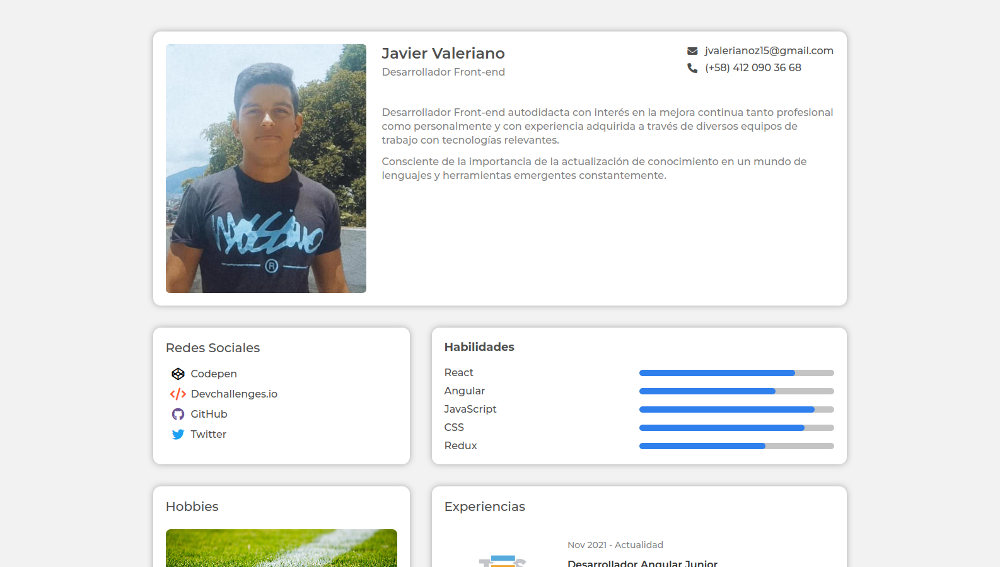
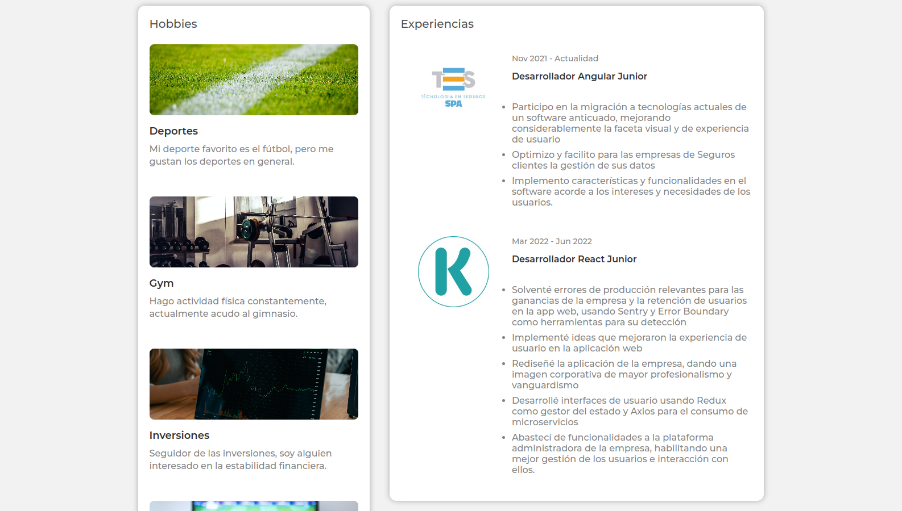
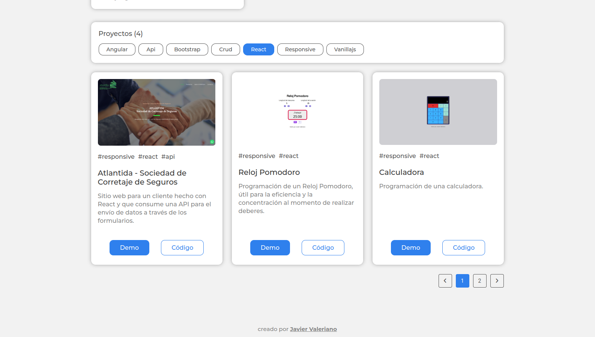
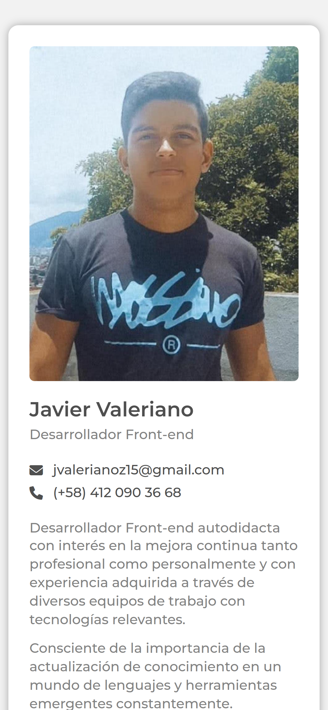
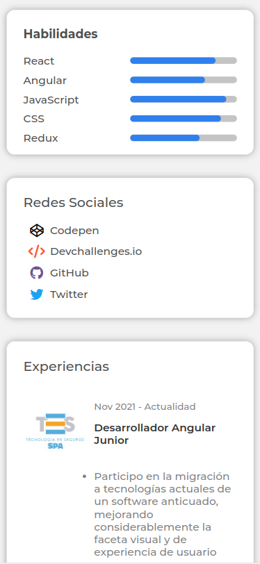
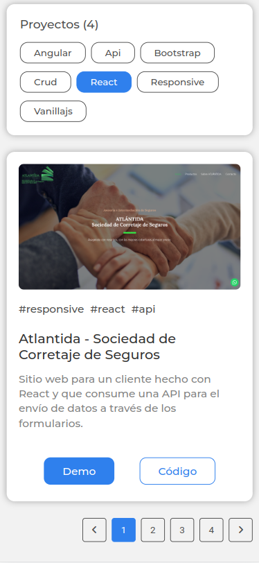

<h1 align="center">Portafolio | Portfolio</h1>

  Solución para un desafío de <a href="https://devchallenges.io">Devchallenges.io</a>. | Solution for a challenge from  <a href="https://devchallenges.io" target="_blank">Devchallenges.io</a>.

  <h3>
    <a href="https://javiervaleriano.github.io/javiervaleriano-portfolio">
      Demo
    </a>
     | 
    <a href="https://{your-url-to-the-solution}">
      Solución / Solution
    </a>
     | 
    <a href="https://devchallenges.io/challenges/5ZnOYsSXM24JWnCsNFlt">
      Desafío / Challenge
    </a>
  </h3>

<!-- TABLE OF CONTENTS -->

## Table of Contents

- [Visión general | Overview](#visi%C3%B3n-general--overview)
  - [Construido con | Built With](#construido-con--built-with)
- [Características | Features](#caracter%C3%ADsticas--features)
- [Cómo usar | How to use](#how-to-use)
- [Agradecimientos | Acknowledgements](#agradecimientos--acknowledgements)
- [Contacto | Contact](#contacto--contact)

<!-- OVERVIEW -->

## Visión general | Overview

### Escritorio | Desktop

### Móvil | Mobile

lang="es": Hola, persona que está viendo mi proyecto. Aquí puedes ver la <a href="https://javiervaleriano.github.io/javiervaleriano-portfolio">demo de mi solución</a>. Este es un desafío en el que aproveché el diseño proporcionado para resaltar mi información y experiencia como desarrollador front-end (por ahora) con el objetivo de conseguir una oportunidad laboral.

Mi experiencia con este proyecto fue un poco desafiante por el tema de la paginación y filtro por etiquetas, todo hecho con Vanilla JS. Sin embargo, me sirvió mucho para refrescar conocimientos y solidificar aún más las bases. Por lo tanto, he mejorado mi conocimiento y la estructuración de mi código.

Además, destaco que este proyecto es una PWA (Aplicación Web Progresiva), por lo que podrás instalarla en tu dispositivo y podrás acceder a ella sin importar que tengas conexión a Internet o no.

lang="en": Hello, person who is viewing my project. Here you can see <a href="https://javiervaleriano.github.io/javiervaleriano-portfolio">the demo of my solution</a>. This is a challenge in which I took advantage of the design provided to highlight my information and experience as a front-end developer (for now) with the goal of getting a job opportunity.

My experience with this project was a bit challenging because of the pagination and tag filtering, all done with Vanilla JS. However, it served me a lot to refresh my knowledge and solidify the basics even more. Therefore, I have improved my knowledge and the structuring of my code.

Also, I emphasize that this project is a PWA (Progressive Web Application), so you can install it on your device and you can access it regardless of whether you have an Internet connection or not.

### Construido con | Built With

<!-- This section should list any major frameworks that you built your project using. Here are a few examples.-->

- [HTML](https://developer.mozilla.org/es/docs/Learn/HTML/Introduction_to_HTML)
- [CSS](https://developer.mozilla.org/es/docs/Learn/CSS)
- [JavaScript](https://developer.mozilla.org/es/docs/Web/JavaScript)

## Características | Features

<!-- List the features of your application or follow the template. Don't share the figma file here :) -->

Esta aplicación/sitio se creó como una entrega a un desafío de [Devchallenges](https://devchallenges.io/challenges). El [desafío](https://devchallenges.io/challenges/5ZnOYsSXM24JWnCsNFlt) fue crear una aplicación para completar las historias de usuario dadas: |
This application/site was created as a submission to a [DevChallenges](https://devchallenges.io/challenges) challenge. The [challenge](https://devchallenges.io/challenges/5ZnOYsSXM24JWnCsNFlt) was to build an application to complete the given user stories.

- User story: Puedo ver detalles personales | I can see personal details

- User story: Puedo ver habilidades | I can see skills

- User story: Puedo ver proyectos | I can see projects

- User story: Puedo filtrar proyectos por etiqueta | I can filter projects by tag

- User story: Puedo ver hobbies | I can see hobbies

- User story: Puedo ver experiencias | I can see experiences

- User story: Puedo ver proyectos en diferentes páginas | I can see projects on different pages.

## Cómo usar | How To Use

Para clonar y ejecutar esta aplicación, simplemente necesitarás [Git](https://git-scm.com), no requieres más nada debido a que es un proyecto Vanilla JS.

To clone and run this application, you will simply need [Git](https://git-scm.com), nothing else is required because it is a Vanilla JS project.

## Agradecimientos | Acknowledgements

<!-- This section should list any articles or add-ons/plugins that helps you to complete the project. This is optional but it will help you in the future. For example: -->

- [Taller Progressive Web Apps - PWA](https://www.youtube.com/playlist?list=PLvq-jIkSeTUYIw8CP2AP7QJs4GeeZdvs6)

## Contacto | Contact

- [Sitio web | Website](https://javiervaleriano.github.io/javiervaleriano-portfolio)
- Codepen [@javiervaleriano](https://codepen.io/javiervaleriano)
- [Devchallenges.io](https://devchallenges.io/portfolio/javiervaleriano)
- GitHub [@javiervaleriano](https://github.com/javiervaleriano)
- Twitter [@javaleriano2](https://twitter.com/javaleriano2)
